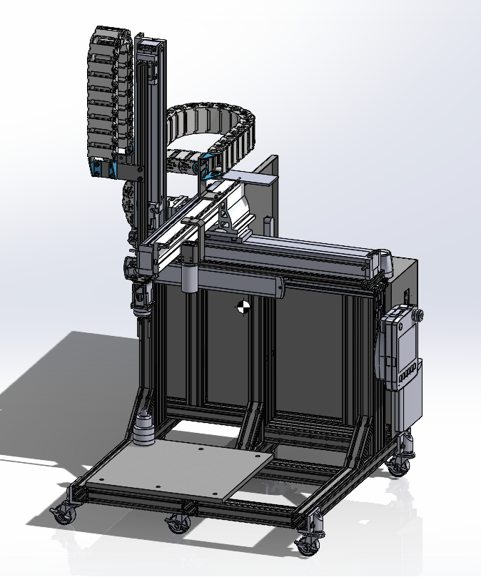

# 3-Axis_Robot

画像処理のVisionのプログラムはBeckhoffのサンプルプログラムを元に作成してます。感謝。  
EtherCATとTerminalの診断プログラムはBeckhoffのEL3351サンプルプログラムを元に作成してます。感謝。  
アラーム処理は日本のBeckhoffの「MachineAlarmManagement」のプログラムを参考にさせてもらってます。感謝。

BeckhoffのTwinCAT3.1、三菱電機のGX Works3、三菱電機のGT Designer3を使用してます。   
一応、下みたいな画像のロボットを動かそうとしてます。なかなか上手くいかないです。難しいです。

Python_MachineLearning/YOLOX 内のコードは、Megviiが公開している YOLOX（Apache License 2.0）を利用しています。

<!--
アルミフレームで組み立てているのですが、微妙に歪んでしまいステージとグリッパーの距離が一定になりません。悲しい。
FBを作ってX軸とY軸の座標からZ軸の指令位置を調整して、ステージとグリッパーの距離が一定になる様に補正してます。
 
3D CADのpdfはこちら→「3D CAD」
 
メモ程度の電気回路はこちら→「電気回路」
 
GOTの非常停止ボタンとデッドマンスイッチを入力するためにEL2911を入れてます。
これで安全か？？？
 
 
ステージ上に適当に置いたマグネットの座標を取得するようにGigEカメラつけて、Vision(TF7000)で処理しようとしてますが、難しくて挫折しそうです。

-->
