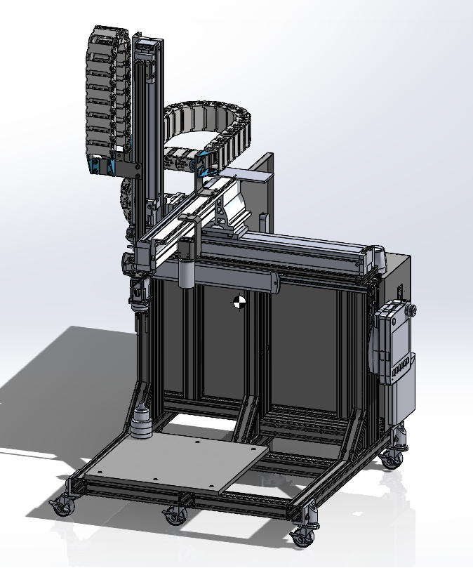

# 3-Axis_Robot

### 画像処理のVisionのプログラムはBeckhoffのサンプルプログラムを元に作成してます。感謝。
### アラーム処理は日本のBeckhoffの「MachineAlarmManagement」のプログラムを参考にさせてもらってます。感謝。

BeckhoffのTwinCAT3.1、三菱電機のGX Works3、三菱電機のGT Designer3を使用してます。
 
一応、下みたいな画像のロボットを動かそうとしてます。なかなか上手くいかないです。難しいです。

<!--
アルミフレームで組み立てているのですが、微妙に歪んでしまいステージとグリッパーの距離が一定になりません。悲しい。
FBを作ってX軸とY軸の座標からZ軸の指令位置を調整して、ステージとグリッパーの距離が一定になる様に補正してます。
 
3D CADのpdfはこちら→「3D CAD」
 
メモ程度の電気回路はこちら→「電気回路」
 
 
Fx5sとTwinCATをModbus TCPで接続して、Fx5s経由でGOTからTwinCATを操作している形です。
Fx5sのシンプル通信機能を使用して、一定周期でTwinCATのModbusサーバーに値の書き込みと読み取りをしてます。
 
XARが入っているPCのTwinCATのビルドを4026にすると、なぜかModbus TCP(TF6250)のコンフィグレーションに失敗するようになったので、4024に戻して使ってます。
自分のバージョンアップ方法が悪いのか。。。
 
 
GOTの非常停止ボタンとデッドマンスイッチを入力するためにEL2911を入れてます。
これで安全か？？？
 
 
ステージ上に適当に置いたマグネットの座標を取得するようにGigEカメラつけて、Vision(TF7000)で処理しようとしてますが、難しくて挫折しそうです。

-->
